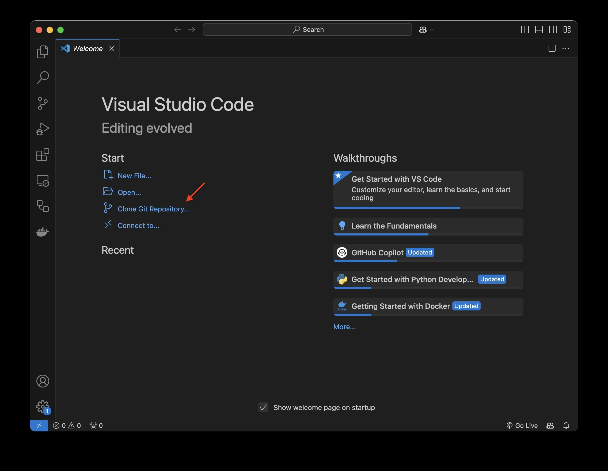
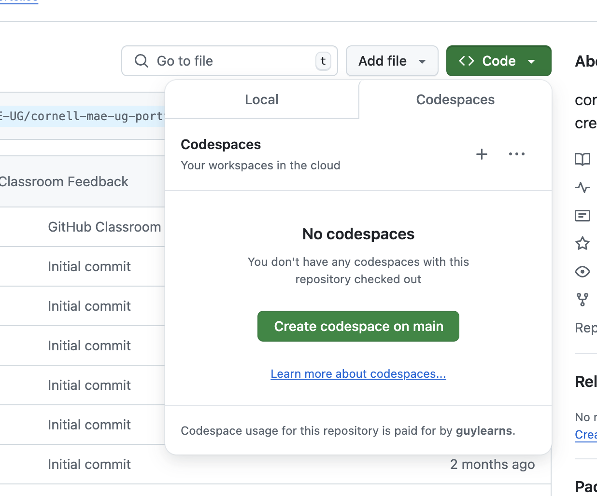
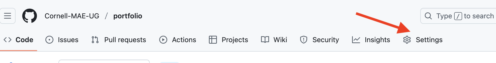
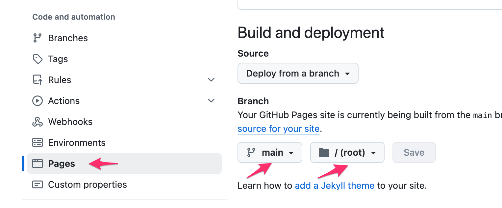

# Portfolio Instructions

This is a template for you to start building your professional portfolio. It is also part of your journey at MAE and will be reviewed, as needed, by your instructor and the Undergraduate Program Office.

Note that this is your personal copy of the portfolio template repository. It was created automatically when you accepted the Assignment through the GitHub Classroom link you were provided.

## Portfolio Editing Workflow
The workflow of editing and publishing your portfolio goes as follows:

1. **Create a local copy** of your portfolio, either on your computer or in an online "Codespace".
2. **Edit any relevant template files**, add images, new project pages, text, etc. Remember to [commit](https://docs.github.com/en/get-started/using-git/about-git#basic-git-commands) often to save your progress.
3. Test out your portfolio by **running a local test server** and see if it looks as planned.
4. If you're happy, make sure everything is committed and **push your changes to Github**. This will publish your portfolio on the Internet.
5. Rinse and repeat from Step 2 above. 

---

## Creating a Local Copy
There are three ways to set up a working copy of the portfolio code for you to edit. From easy to hard: you can either **create an online workspace** on called "Codespace", or clone the code directly **inside Visual Studio Code** for editing, committing, and pushing, or **use the git command line interface (CLI)** to maintain your local copy.

### Using Visual Studio Code

You can use [VS Code](https://code.visualstudio.com/) to clone your code, edit, test, and publish it from your laptop. This means you can work offline and generally have full control of your code. 

Download and install VS Code. When you open it, choose "Clone Git Repository" to start a new project from your repository. Then enter the repo URL (also under the "Code" button in GitHub). 




You can then use VS Code for editing and [Git actions](https://code.visualstudio.com/docs/sourcecontrol/overview). Please refer to the [VS Code documentation](https://code.visualstudio.com/docs/) for more information. 

### Using Codespaces

Alternatively, you can use the online [Codespaces](https://github.com/features/codespaces) environments for development. Please read more about this feature through the following [link](https://github.com/features/codespaces). This option is available to you through the "Code" button as shown in the image below. This starts an online space for you to edit, test, and commit your work.



### Using the Git CLI

Finally, if you are an advanced user, you can simply clone your repository to your local machine using the Git command line interface in the terminal, and then use any text editing software you prefer to edit the files. 

Use the terminal to commit and push your files and run the local test server.

```bash
git clone https://github.com/<your-username>/<your-repo>.git
cd <your-repo>
```

---

## Editing the Files to Personalize Your Portfolio

GitHub Pages, the framework powering the portfolio system, uses [Jekyll](https://jekyllrb.com/) as the core technology. This means you will use [GitHub Pages Markdown](https://www.markdownguide.org/tools/github-pages/) to edit your files. 

### Name

Change references to `<Your Name>` to your actual name in the following files:
- `_config.yml`
- `index.md`
- `projects.md`
- `cv.md`

No need to keep the `< >` brackets. They are just there to indicate placeholders.

### Homepage
- `index.md`: Replace the placeholder text with a welcome or pitch paragraph about yourself.
- `assets/images/profile-pic.jpg`: Replace the placeholder with a portrait of yourself.

### Projects
- In the `_projects` folder: Use the provided example pages (e.g., `2022-trig-analysis.md`) to build one page per project.
- Each project has a main (square) project image, set in the page's top matter by the `image` variable.
- All images are in `assets/images`. Delete the ones you don't need.
- It is useful to name the page with a leading date. This will determine the order of projects on your main portfolio gallery.
- You can also develop another ordering by naming the projects with some numerical prefix.
- The example project pages show you how to include code and images in the portfolio page.
- Refer to the Jekyll Markdown documentation for other formatting tips

### CV
- `assets/CV.pdf`: Replace this placeholder with your own PDF CV.
- You can either edit or delete the placeholder CV markdown text.

### Color Schemes

The provided template comes with multiple color schemes. To choose a scheme:

1. Open the `_config.yml` file.
2. Look for the `color_scheme` setting.
3. Change the value to the desired skin name. Refer to the inline comment in `_config.yml` for available skin options.


Example:
```yaml
skin: aqua
```

### More Customization
You can also change the style of any component of the portfolio editing the `custom.scss` file, which is written in the [Sass](https://sass-lang.com/) language.

---

## Running the Site Locally

Once you made your changes, or at any time you wish to, you can test your changes locally, by running `bundle`. All of this happens **in the terminal**, either on Codespaces, or in VS Code, or directly in your terminal app, depending on how you set up your local code.

### Prerequisites

To run `bundle`, you need Ruby installed on your machine. 

For MacOS, the recommended path is to install [`homebrew`](https://brew.sh/): 
```
/bin/bash -c "$(curl -fsSL https://raw.githubusercontent.com/Homebrew/install/HEAD/install.sh)"
```

and then Ruby:
```
brew install ruby
```

Make sure your system uses the `homebrew` version, add the following line to either `~/.bashrc` or `~/.zshrc`. Do determine what shell you are using, you can run `echo $SHELL`.

```
export PATH="/opt/homebrew/opt/ruby/bin:$PATH"
```

Close your terminal and reopen it to load your configuration. Now verify that you have the latest Ruby version: 
```
ruby -v
```

On Windows, you can use [RubyInstaller](https://rubyinstaller.org/).

### Install Packages (once)

You only need to run this command the first time you try to run jekyll, to install the relevant packages: 
```bash
bundle install
```

### Running the Local Portfolio Server
Then, to run the server you run the `jekyll serve` command:
```bash
bundle exec jekyll serve
```

Note that many updates to your code are automatically reloaded into the web server. However, some changes, notably to `_config.yml` require a restart of the jekyll server.

You can access the site at the URL shown by the `serve` command. It looks something like this:
```python
    Server address: http://127.0.0.1:4000/
  Server running... press ctrl-c to stop.
```

---

## Publishing your Portfolio to the Web

### Push your Changes to GitHub

Once everything looks good, commit and push your changes. In the command line, run the following commands. Ideally, you would have added and committed many times locally before pushing to Github.

```bash
git add .
git commit -m "<Commit Edit>"
git push origin main
```

In VS Code or Codespaces, you can use the Git interface inside the development environment to stage (add), commit, and push your changes.

### Set Up GitHub Pages

Follow these steps to publish your portfolio:

1. In your `_config.yml` file, set the `baseurl` to your portfolio repo name (e.g., `"/spring-2025-portfolio-Hoffman/"`)


1. Go to your repository's Settings


3. Choose the "Pages" tab under "Build and Deployment", verify that "Source" says "Deploy from a branch" and under "Branch" choose `main` and `/ (root)`


4. Don't forget to save this setting at the bottom of the page.

### Your Published Portfolio Site
Your portfolio should be live at `https://cornell-mae-ug.github.io/<your-repo>/`, where `your-repo` is this repository's name, probably `portfolio-<your-github-username>`. This URL is also shown in your Pages setting tab.

:tada:

**You can now replace this template README file with a more informative text**, but check out additional tips and tricks below.

### More Control over Publishing

If you add plugins and add-ons, you might need to publish using your own Gemfile, and other custom actions. See the following link to learn everything about [publishing a Jekyll site with Github Pages](https://jekyllrb.com/docs/continuous-integration/github-actions/).

---

## More Customization: Using Other Jekyll Themes

As mentioned, your portfolio uses [Jekyll](https://jekyllrb.com/) underneath the hood. For more advanced styling of your portfolio, check out [this documentation](https://docs.github.com/en/pages/setting-up-a-github-pages-site-with-jekyll).

This also means that you can customize your portfolio to a greater extent by using other Jekyll themes. Here are some good places to find themes:

- [Start Bootstrap](https://startbootstrap.com/themes/jekyll/)
- [Jekyll Themes](https://jekyllthemes.io/)
- [Jekyll Theme](http://jekylltheme.org/)
- [Jekyll Themes on GitHub](https://github.com/topics/jekyll-theme)

Follow the theme's installation and customization instructions as needed to fit your portfolio content.

## Tips and Tricks

### Commenting Out Content

You can comment out a bit of text or an image by using the `` command:

```ruby

    Stuff you want to comment out.

```

### Changing the text width

Change any styling by editing the `custom.scss` file, a Sass file, which is a superset of CSS.

For example, change the text width by changing the `max-width` of `.container`:

```css
.container {
  max-width: 1000px;
}
```
